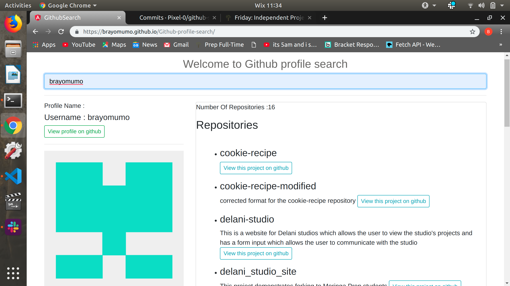

# Github profile-search
#### This is an application which displays the user profile of the github-user name entered 16 July,2019
#### By **Brian Mumo Paul**
## Description
This is an application which allows a user to search for a github profilre and displays the searched repositories, image and links to their repositories.
## Behaviour Driven Development
When the user enters the user name in the search bar, the program displays the searched github information. In the repository's part there is a link which when clicked it opens the repository on github. 
The user can also click on a link to view the profile oh github 

## Setup/Installation Requirements
* Open this link on a supported web broser to interract with the application:
    https://brayomumo.github.io/Github-profile-search
### To view the source code :
* install Atom/Visual studio code
* git init
* git clone https://github.com/brayomumo/Github-profile-search
*  Open the folder where the cloned repository is saved 
* run the command _ngserve_  on your terminal to open the program 

## Technologies Used
* Angular 8 to create the website 
* Git and Github to store and deploy the program

## Support and contact details
In case of any questions or any interest, please contact me using any of the following:
* Email: brayomumo5@gmail.com
### License
MIT Lecense Copyright (c) {2019} **Brian Mumo Paul**
  